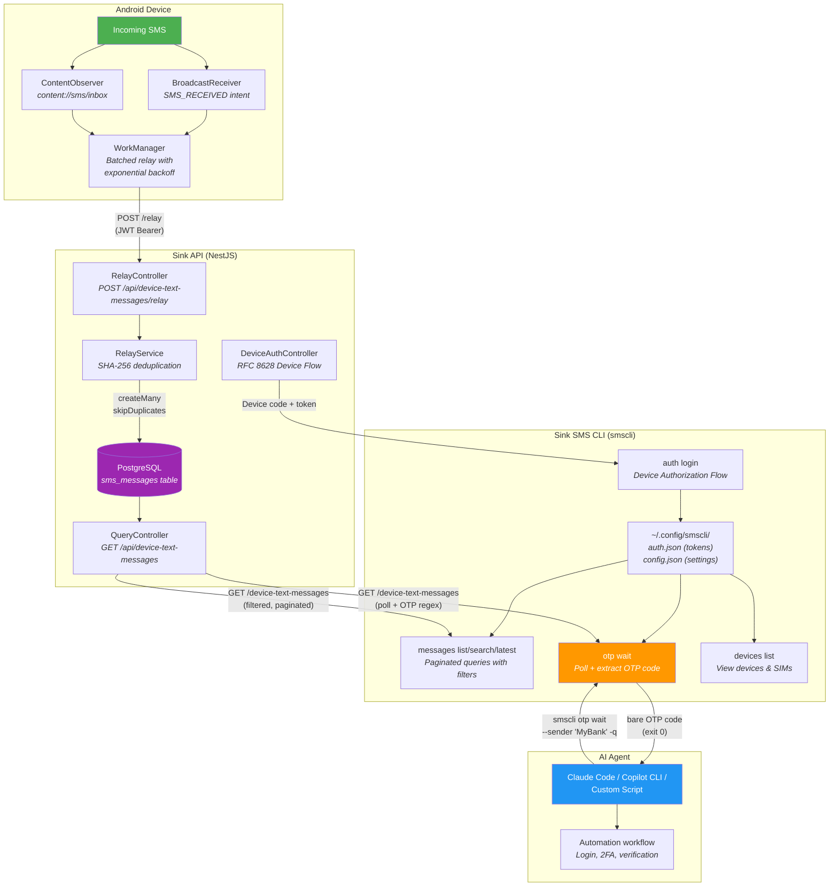

# Sink SMS CLI (`smscli`)

An AI-agent-friendly command-line tool for reading SMS messages and extracting OTP codes from your Android device via the Sink API.

**Primary purpose:** Enable agentic AI systems (Claude Code, GitHub Copilot CLI, custom scripts) to programmatically access SMS messages — especially OTP/verification codes — sent to a personal Android device.

## Architecture

The SMS CLI is the last mile in an end-to-end pipeline that starts with an SMS arriving on your Android phone and ends with an AI agent extracting an OTP code:



### How it works end-to-end

1. **SMS arrives** on your Android device
2. **Android app captures it** via two strategies running simultaneously:
   - `BroadcastReceiver` listening for `SMS_RECEIVED` intent (works on Android < 16 and some OEMs)
   - `ContentObserver` watching `content://sms/inbox` (works on all versions including Android 16+ where `SMS_RECEIVED` is restricted)
3. **Android app relays** the message to the Sink API via `POST /api/device-text-messages/relay` using JWT authentication
4. **API deduplicates** using SHA-256 hash (`deviceId:sender:body:timestamp`) and stores in PostgreSQL
5. **CLI queries** the API via `GET /api/device-text-messages` with filtering by sender, phone number, date range, device, and SIM
6. **OTP parser** extracts verification codes using regex patterns (4-8 digit codes with contextual labels)
7. **AI agent** invokes `smscli otp wait --sender "MyBank" -q` and receives the bare OTP code

> **Important:** RCS messages are NOT captured. The Android app only sees traditional SMS stored in the `content://sms` content provider. See [Android App docs](../../docs/ANDROID-APP.md) for details and workarounds.

### Related documentation

- **[SMS Relay API](../../docs/SMS-RELAY-API.md)** — Server-side API: database schema, endpoints, permissions, deduplication strategy
- **[Android App](../../docs/ANDROID-APP.md)** — Android companion app: SMS capture strategies, authentication, message sync

---

## Installation

The CLI is part of the Sink monorepo and uses npm workspaces.

```bash
# From the repository root
npm install

# Build the CLI
npm -w tools/smscli run build

# Verify installation
node tools/smscli/bin/smscli.js --help

# Or via the root package.json script
npm run smscli -- --help
```

### System-wide installation (recommended for Linux/Ubuntu)

The included `install.sh` script installs `smscli` so it can be invoked from anywhere. It also handles updates — just run it again.

```bash
# Install (or update)
cd tools/smscli
./install.sh

# Now available globally
smscli --version
# 2026.3.1

# Uninstall
./install.sh --uninstall
```

**What `install.sh` does:**
1. Checks prerequisites (Node.js >= 18, npm)
2. Installs npm dependencies (detects monorepo workspace)
3. Builds TypeScript
4. Creates a symlink at `/usr/local/bin/smscli` → `tools/smscli/bin/smscli.js`
5. Verifies the installation

**To update:** pull the latest code and run `./install.sh` again. It rebuilds and re-links.

### Alternative: npm link

```bash
cd tools/smscli
npm link
smscli --help
```

---

## Quick Start

```bash
# 1. Configure the API URL (if not using default localhost:3535)
smscli config set-url https://your-server.example.com

# 2. Authenticate using the device authorization flow
smscli auth login
# → Opens browser, displays a code, waits for approval

# 3. Check your devices and phone numbers
smscli devices list
# → Shows registered devices with SIM details (carrier, phone number)

# 4. View recent messages
smscli messages latest

# 5. Wait for an OTP (the killer feature)
smscli otp wait --sender "MyBank" --quiet
# → Polls for a new message, extracts the OTP code, prints just the digits
```

---

## Output Modes

Every command supports three output modes, controlled by global flags:

| Mode | Flag | Description | Use case |
|------|------|-------------|----------|
| **Human** | *(default)* | Rich terminal output with colors, tables, and formatting | Interactive use |
| **JSON** | `--json` | Machine-readable JSON envelope: `{"success": true, "data": ...}` | AI agents, scripts |
| **Quiet** | `-q, --quiet` | Bare essential values, no formatting | Shell piping |

### JSON envelope format

```json
// Success
{"success": true, "data": { ... }}

// Error
{"success": false, "error": "Human-readable message", "code": "ERROR_CODE"}
```

- **Data** goes to `stdout` — pipe to `jq .data` for the payload
- **Errors** go to `stderr` — always visible even when piping stdout

---

## Command Reference

### Global Flags

| Flag | Description |
|------|-------------|
| `--json` | Output all results as machine-readable JSON. Format: `{"success": true, "data": ...}` or `{"success": false, "error": "...", "code": "..."}`. Errors go to stderr, data to stdout. Ideal for AI agents and scripts — parse with `jq .data`. |
| `-q, --quiet` | Minimal output mode. Print only essential values with no formatting, headers, or decoration. For OTP commands, prints just the bare code. For message lists, prints one message per line (tab-separated). Ideal for shell piping. |
| `--api-url <url>` | Override the Sink API base URL for this invocation only. Takes precedence over the config file and `SMSCLI_API_URL` environment variable. |
| `--no-color` | Disable all ANSI color codes in output. Useful for logging, CI environments, or terminals that don't support colors. |
| `-v, --verbose` | Enable verbose logging. Shows HTTP request/response details, token refresh events, and SIM resolution steps. |

---

### `smscli auth`

Manage authentication with the Sink API.

#### `smscli auth login`

Authenticate using the OAuth 2.0 Device Authorization flow (RFC 8628). Opens a browser to the activation page, displays a one-time user code, and polls until the user approves. Tokens are stored at `~/.config/smscli/auth.json`.

```bash
smscli auth login
# Opening browser to: https://your-server.example.com/activate?code=ABCD-1234
# Your code: ABCD-1234
# Waiting for authorization...
# Logged in as user@example.com
```

#### `smscli auth logout`

Remove all stored authentication tokens from the local machine.

```bash
smscli auth logout
```

#### `smscli auth status`

Display the current authentication state: email, roles, token expiry, and validity.

```bash
smscli auth status
# Auth Status
# ───────────
#   Email: user@example.com
#   Roles: admin, contributor
#   Expires: 2026-03-30T14:15:00.000Z
#   Status: ✓ Valid

smscli auth status --json
# {"success":true,"data":{"authenticated":true,"email":"user@example.com","roles":["admin"],"expiresAt":"...","expired":false}}
```

#### `smscli auth refresh`

Force an immediate refresh of the access token.

```bash
smscli auth refresh
```

---

### `smscli messages`

List, search, watch, and export SMS messages.

#### `smscli messages list`

List SMS messages with pagination and filtering. Results ordered by timestamp (newest first).

| Flag | Description |
|------|-------------|
| `--sender <pattern>` | Filter by sender address. Case-insensitive substring match. `--sender "ACME"` matches "ACME-BANK", "ACME Corp". |
| `--number <phone>` | Filter by the **receiving** phone number (your SIM). Supports full (`+12488057580`) or suffix (`7580`) match. |
| `--from <iso-date>` | Messages on or after this date (ISO 8601). |
| `--to <iso-date>` | Messages on or before this date (ISO 8601). |
| `--device <uuid>` | Filter by device ID. |
| `--sim <uuid>` | Filter by SIM ID. Prefer `--number` for convenience. |
| `--page <n>` | Page number (default: 1). |
| `--page-size <n>` | Items per page (1-100, default: 20). |
| `--limit <n>` | Max total messages (auto-paginates). |

```bash
# List all messages
smscli messages list

# Filter by sender and receiving phone number
smscli messages list --sender "MyBank" --number "+12488057580"

# Last 50 messages as JSON
smscli messages list --limit 50 --json

# Messages from the last hour
smscli messages list --from "$(date -u -d '1 hour ago' +%Y-%m-%dT%H:%M:%SZ)"
```

#### `smscli messages search <pattern>`

Shorthand for `messages list --sender <pattern>`.

```bash
smscli messages search "Google"
```

#### `smscli messages latest`

Show the most recent N messages (default: 10).

| Flag | Description |
|------|-------------|
| `-n, --count <n>` | Number of messages (default: 10, max: 100). |
| `--sender <pattern>` | Filter by sender. |
| `--number <phone>` | Filter by receiving number. |

```bash
smscli messages latest
smscli messages latest -n 5 --sender "ACME"
smscli messages latest --number "7580" --json
```

#### `smscli messages watch`

Continuously poll for new messages. Runs until Ctrl+C. In JSON mode, outputs NDJSON (one JSON object per line).

| Flag | Description |
|------|-------------|
| `--sender <pattern>` | Only show messages matching this sender. |
| `--number <phone>` | Only show messages on this number. |
| `--interval <seconds>` | Poll interval (default: 5s). |

```bash
smscli messages watch --sender "MyBank"
smscli messages watch --json  # NDJSON output
```

#### `smscli messages export`

Export all matching messages (auto-paginates through all pages).

| Flag | Description |
|------|-------------|
| `--format <json\|csv>` | Output format (default: json). |
| `--output <file>` | Write to file instead of stdout. |
| All `messages list` filters. ||

```bash
smscli messages export --format csv --output messages.csv
smscli messages export --sender "ACME" --from "2026-01-01T00:00:00Z"
```

---

### `smscli otp`

Extract OTP (One-Time Password) codes from SMS messages. The core feature for AI agent automation.

#### `smscli otp wait`

**The flagship command.** Polls the API for new SMS messages, extracts the OTP code, and returns it. Exit code 0 on success, 1 on timeout.

**All filters are optional.** You can omit `--sender` to watch ALL incoming messages for an OTP code — useful when the sender name is unknown or changes between messages.

| Flag | Description |
|------|-------------|
| `--sender <pattern>` | Filter by sender (case-insensitive substring). If omitted, checks **all** messages. |
| `--number <phone>` | Only watch on this phone number/SIM. |
| `--timeout <seconds>` | Max wait time (default: 120s). Exit code 1 on timeout. |
| `--interval <seconds>` | Poll frequency (default: 3s). |
| `--since <iso-date>` | Look for messages from this time (default: now). |
| `--device <uuid>` | Limit to a specific device. |

```bash
# Wait for OTP from ANY sender (sender unknown or changes)
smscli otp wait -q
# 483921

# Wait for OTP from a specific sender
smscli otp wait --sender "MyBank" -q
# 483921

# Filter by receiving phone number (no sender filter)
smscli otp wait --number "+12488057580" --timeout 60 -q

# With sender filter and phone number
smscli otp wait --sender "Google" --number "7580" --timeout 60

# JSON output for programmatic use
smscli otp wait --json
# {"success":true,"data":{"code":"483921","sender":"MyBank Alerts","body":"Your code is 483921","smsTimestamp":"...","receivedAt":"...","messageId":"..."}}

# Capture in a shell variable
OTP=$(smscli otp wait -q)
echo "Got OTP: $OTP"
```

#### `smscli otp extract`

Extract OTP from arbitrary text (offline utility, no API call).

| Flag | Description |
|------|-------------|
| `--message <text>` | Text to extract from. If omitted, reads stdin. |

```bash
# From flag
smscli otp extract --message "Your verification code is 123456"
# 123456

# From stdin
echo "OTP: 789012" | smscli otp extract -q
# 789012
```

#### `smscli otp latest`

Get the most recent OTP code without polling. Use when you know the OTP has already arrived.

**All filters are optional.** Without `--sender`, checks the most recent messages from any sender.

| Flag | Description |
|------|-------------|
| `--sender <pattern>` | Filter by sender. If omitted, checks messages from **all** senders. |
| `--number <phone>` | Filter by receiving number. |
| `--since <iso-date>` | Only look at messages from this time onwards. |
| `--device <uuid>` | Limit to a specific device. |

```bash
# Get the latest OTP from any sender
smscli otp latest -q
# 543210

# Get the latest OTP from a specific sender
smscli otp latest --sender "Google" -q
# 543210

# Get the latest OTP on a specific phone number
smscli otp latest --number "7580" --json
```

---

### `smscli devices`

View registered Android devices and their SIM cards.

#### `smscli devices list`

List all devices with full SIM card information. This is the command to run first to discover your device IDs, SIM IDs, and phone numbers.

```bash
smscli devices list

# Devices (1)
# ──────────
#
# Google Pixel 8  (android)
#   ID:          550e8400-e29b-41d4-a716-446655440001
#   Model:       Google Pixel 8
#   OS:          Android 15
#   App Version: 1.0.0
#   Last Seen:   2026-03-29 14:00 UTC
#   Active:      Yes
#
#   SIMs:
#   Slot  Carrier     Phone Number      Display Name  ICC ID
#   ────────────────────────────────────────────────────────────
#   0     T-Mobile    +15551234567      Personal      890126…
#   1     AT&T        +15557654321      Work          890141…

# JSON output
smscli devices list --json
```

#### `smscli devices inspect <id>`

Detailed view of a single device with all metadata and SIMs. Accepts full UUID or prefix.

```bash
smscli devices inspect 550e8400
```

---

### `smscli senders`

#### `smscli senders list`

List all unique sender addresses. Useful for discovering available `--sender` patterns.

```bash
smscli senders list
# Senders (4)
# ───────────
#   +15551234567
#   +15559876543
#   ACME-BANK
#   T-Mobile

smscli senders list --json
# {"success":true,"data":["+15551234567","+15559876543","ACME-BANK","T-Mobile"]}
```

---

### `smscli config`

#### `smscli config show`

Display current configuration with source information.

```bash
smscli config show
# Configuration
# ─────────────
#   App URL:     https://vitalmesh.dev.marin.cr (config)
#   API URL:     https://vitalmesh.dev.marin.cr/api
#   Config Dir:  /home/user/.config/smscli
#   Auth File:   /home/user/.config/smscli/auth.json
```

#### `smscli config set-url <url>`

Set the application base URL. API URL is derived by appending `/api`.

```bash
smscli config set-url https://vitalmesh.dev.marin.cr
```

#### `smscli config reset`

Reset configuration to defaults. Preserves auth tokens.

```bash
smscli config reset
```

---

### `smscli doctor`

Run a comprehensive health check.

```bash
smscli doctor
# Doctor
# ──────
#   ✓ Configuration: API URL: https://vitalmesh.dev.marin.cr/api (source: config)
#   ✓ API Connectivity: live=true, ready=true
#   ✓ Authentication: user@example.com
#   ✓ SMS Permissions: Can query messages endpoint
#   ✓ Devices: 1 device(s), 2 SIM(s)
#
# All checks passed!
```

---

## AI Agent Integration Examples

### Claude Code

```
User: "Log in to my bank account and complete 2FA"

Claude Code:
1. Opens bank login page via browser automation
2. Enters credentials
3. Bank sends SMS with OTP code
4. Runs: smscli otp wait --number "+12488057580" --timeout 60 -q
   (no --sender needed — catches OTP from any sender)
5. Receives: 483921
6. Enters OTP code to complete 2FA
```

### Shell Script

```bash
#!/bin/bash
# Automated login with OTP

# Trigger the OTP (e.g., via API call or browser automation)
trigger_otp_send

# Wait for OTP from any sender (sender name may vary)
OTP=$(smscli otp wait --number "7580" -q --timeout 90)
if [ $? -ne 0 ]; then
  echo "Failed to receive OTP" >&2
  exit 1
fi

# Or filter by sender if known
# OTP=$(smscli otp wait --sender "MyService" -q --timeout 90)

# Use the OTP
curl -X POST https://api.example.com/verify -d "code=$OTP"
```

### JSON Processing with jq

```bash
# Get the latest message body
smscli messages latest -n 1 --json | jq -r '.data.items[0].body'

# Get all senders as a flat list
smscli senders list --json | jq -r '.data[]'

# Get device phone numbers
smscli devices list --json | jq -r '.data[].sims[].phoneNumber'
```

---

## Configuration

### Environment Variables

| Variable | Description | Default |
|----------|-------------|---------|
| `SMSCLI_APP_URL` | Application base URL | `http://localhost:3535` |
| `SMSCLI_API_URL` | API URL (overrides derived URL) | `{APP_URL}/api` |
| `SMSCLI_CONFIG_DIR` | Config directory path | `~/.config/smscli` |

**Priority:** `--api-url` flag > `SMSCLI_API_URL` env > derived from `SMSCLI_APP_URL` env > config file > default.

### Config File

Stored at `~/.config/smscli/config.json`:

```json
{
  "appUrl": "https://vitalmesh.dev.marin.cr"
}
```

### Auth Tokens

Stored at `~/.config/smscli/auth.json` with permissions `0o600` (owner read/write only):

```json
{
  "accessToken": "eyJ...",
  "refreshToken": "a1b2c3...",
  "expiresAt": 1711800000000
}
```

Access tokens are short-lived (15 min default) and automatically refreshed using the stored refresh token.

---

## OTP Extraction Patterns

The OTP parser recognizes these patterns (case-insensitive):

| Pattern | Example |
|---------|---------|
| `code is/: <digits>` | "Your code is 123456" |
| `OTP is/: <digits>` | "OTP: 4567" |
| `verification code is/: <digits>` | "Your verification code: 654321" |
| `security code: <digits>` | "Your security code: 234567" |
| `confirmation code: <digits>` | "Confirmation code: 345678" |
| `PIN is/: <digits>` | "PIN: 9876" |
| `passcode: <digits>` | "Your passcode: 456789" |
| `<digits> is your code/OTP/PIN` | "123456 is your verification code" |
| `use <digits> to verify/login` | "Use 123456 to verify your account" |
| `enter <digits>` | "Please enter 789012" |
| Standalone 4-8 digits (fallback) | "Alert: 876543 for today" |

Codes must be 4-8 digits. Phone numbers with `+` prefix are excluded.

---

## Versioning

smscli uses **calendar-based versioning**: `YYYY.M.patch`

| Component | Meaning | Example |
|-----------|---------|---------|
| `YYYY` | Release year | `2026` |
| `M` | Release month (no leading zero) | `3` = March |
| `patch` | Sequential release within the month | `1`, `2`, `3`, … |

**Examples:** `2026.3.1` (first release of March 2026), `2026.3.2` (second release that month), `2026.4.1` (first April release).

The version is defined in a single source of truth: `src/version.ts`. To bump the version, edit that file and run `./install.sh` to update.

```bash
smscli --version
# 2026.3.1
```

---

## Security

- **Token storage**: Auth tokens stored at `~/.config/smscli/auth.json` with file permissions `0600` (owner-only read/write)
- **No secrets in CLI args**: Tokens are never passed as command-line arguments (which would be visible in process lists)
- **Short-lived access tokens**: 15-minute default TTL with automatic refresh
- **Device authorization flow**: No password entry in the CLI — authentication happens in the browser via OAuth

---

## Development

```bash
# Build
npm -w tools/smscli run build

# Watch mode (rebuilds on changes)
npm -w tools/smscli run dev

# Run tests
npm -w tools/smscli run test

# Type check
npm -w tools/smscli run typecheck

# Run directly (after build)
node tools/smscli/bin/smscli.js --help
```

### Project Structure

```
tools/smscli/
├── bin/smscli.js          # Entry point (shebang script)
├── install.sh             # System-wide installer (Linux/Ubuntu)
├── src/
│   ├── index.ts           # Commander setup, global flags
│   ├── version.ts         # Version constant (single source of truth)
│   ├── commands/          # Command implementations
│   │   ├── auth.ts        # login, logout, status, refresh
│   │   ├── messages.ts    # list, search, latest, watch, export
│   │   ├── otp.ts         # wait, extract, latest
│   │   ├── devices.ts     # list, inspect
│   │   ├── senders.ts     # list
│   │   ├── config.ts      # show, set-url, reset
│   │   └── doctor.ts      # health checks
│   ├── lib/               # Business logic
│   │   ├── api-client.ts  # HTTP client with auth + SMS methods
│   │   ├── auth-store.ts  # Token persistence
│   │   ├── device-flow.ts # RFC 8628 device authorization
│   │   ├── otp-parser.ts  # OTP regex extraction
│   │   └── formatters.ts  # Human-readable output formatters
│   └── utils/             # Shared utilities
│       ├── config.ts      # Configuration management
│       ├── output.ts      # OutputManager (json/quiet/human)
│       └── types.ts       # TypeScript interfaces
├── test/                  # Jest tests
│   └── otp-parser.spec.ts # OTP extraction tests (32 cases)
├── package.json
├── tsconfig.json
└── jest.config.cjs
```
